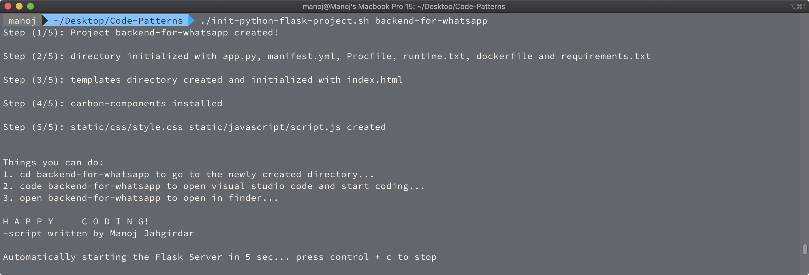
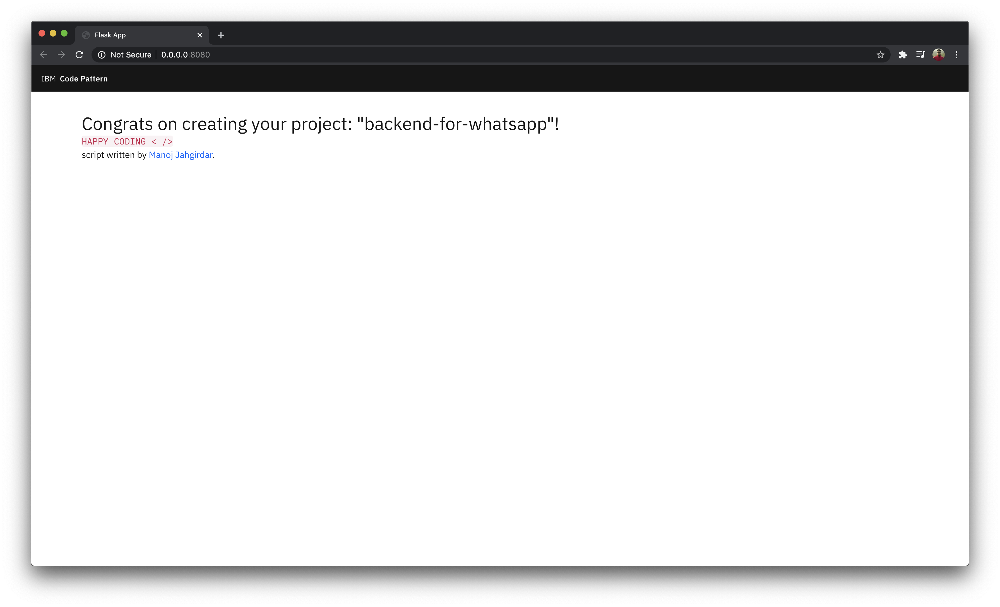

# Automated Flask Server Setup

## About
A simple shell script that will setup a Python-Flask server project structure, which can be readily deployed on [IBM Cloud](https://cloud.ibm.com).


## Steps to Run the script

### Step 1: Clone the Repo

- In terminal, run the following command to clone the repo.
```bash
git clone https://github.com/manojjahgirdar/Automated-Flask-Server-Setup
```

### Step 2: Run the shellscript

>Make sure you have [python 3.x]() installed before proceeding.

- Give the **executable** permission to the shellscript, Open terminal in cloned repo and run the following command.

```bash
chmod +x ./init-python-flask-project.sh
```

- The `init-python-flask-project.sh` takes one parameter `<project-name>` where `<project-name>` is the project that you want to create.
    - `init-python-flask-project.sh <project-name>`

- Create a Python-Flask server with the project structure which is ready to be deployed on IBM Cloud by running the following command in the terminal.

```bash
./init-python-flask-project.sh <project-name>
```



- The Script will automatically _open Visual Studio Code_ for you to start coding right away! It will also create a _python3 virtual environment_, _install requirements_ and _run the flask server_ ready listening on `8080`.

- The following files will be created in the directory with `<project-name>`

```bash
<project-name>
├── Procfile
├── app.py
├── dockerfile
├── manifest.yml
├── requirements.txt
├── runtime.txt
├── static
│   ├── carbon-components
│   │   └── . . .
│   ├── carbon-icons
│   │   └── . . .
│   ├── css
│   │   └── style.css
│   └── javascript
│       └── script.js
└── templates
    └── index.html
```

- Visit <http://localhost:8080> on your browser to view the application.



- The project can be deployed on [IBM Cloud](https://cloud.ibm.com) by following the simple steps.

## Step 3: Deploy on IBM Cloud (optional)


- Before you proceed, make sure you have installed [IBM Cloud CLI](https://cloud.ibm.com/docs/cli?topic=cloud-cli-getting-started&locale=en-US) in your deployment machine.

- Open the project directory in terminal, and run the following commands to deploy the Application to IBM Cloud Foundry.

* Log in to your IBM Cloud account, and select an API endpoint.
```bash
$ ibmcloud login
```

>NOTE: If you have a federated user ID, instead use the following command to log in with your single sign-on ID.
```bash
$ ibmcloud login --sso
```

* Target a Cloud Foundry org and space:
```bash
$ ibmcloud target --cf
```

* From within the _project directory_ push your app to IBM Cloud.
```bash
$ ibmcloud cf push
```

- The [manifest.yml](manifest.yml) file will be used here to deploy the application to IBM Cloud Foundry.

- On Successful deployment of the application you will see something similar on your terminal as shown.

<pre><code>Invoking 'cf push'...

Pushing from manifest to org manoj.jahgirdar@in.ibm.com / space dev as manoj.jahgirdar@in.ibm.com...

...

Waiting for app to start...

name:              Flask-App
requested state:   started
routes:            <b>Flask-App.xx-xx.mybluemix.net </b>
last uploaded:     Sat 16 May 18:05:16 IST 2020
stack:             cflinuxfs3
buildpacks:        python

type:            web
instances:       1/1
memory usage:    256M
start command:   python app.py
     state     since                  cpu     memory           disk           details
#0   <b>running</b>   2020-05-16T12:36:15Z   25.6%   116.5M of 256M   796.2M of 1
</code></pre>

* Once the app is deployed you can visit the `routes` to launch the application.

## License

This code pattern is licensed under the Apache License, Version 2. Separate third-party code objects invoked within this code pattern are licensed by their respective providers pursuant to their own separate licenses. Contributions are subject to the [Developer Certificate of Origin, Version 1.1](https://developercertificate.org/) and the [Apache License, Version 2](https://www.apache.org/licenses/LICENSE-2.0.txt).

[Apache License FAQ](https://www.apache.org/foundation/license-faq.html#WhatDoesItMEAN)
